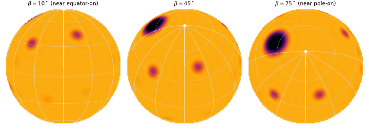
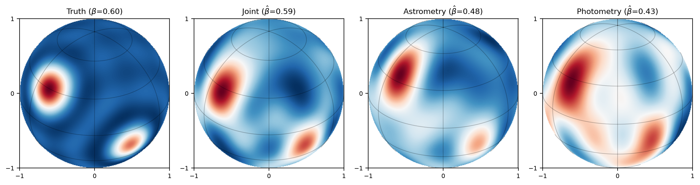

# jittermap

[](https://www.gnu.org/licenses/gpl-3.0)
[](https://jittermap.readthedocs.io/en/latest/)

**Documentation: [jittermap.readthedocs.io](https://jittermap.readthedocs.io)**

<p align="center">
  
</p>

## Overview

Developed by Jamila Taaki (University of Michigan).

**jittermap** is a Python library for stellar surface mapping from astrometric
jitter and photometry. It is the reference implementation of the methods
developed in the paper:

> **Taaki, J. S., Corrales, L., & Hero, A. O. III (2026),
> "Using Astrometry to Break Degeneracies in Stellar Surface Mapping",
> The Astrophysical Journal. arXiv:2601.11737**

The forward model, the astrometric/photometric moment kernels, the Wigner
rotation formulation, the identifiability results, and the reconstruction
approach implemented here are all derived in that paper. **If you use
jittermap — or code or results derived from it — in published work, please
cite the paper** (see [Citing](#citing) below).

Astrometric jitter arises when starspots on a rotating stellar surface move
in and out of view, shifting the observed photocenter; this jitter is a
noise floor for detecting small exoplanets, but it also carries information
about the stellar surface itself.

jittermap implements a linear forward model for the astrometric jitter and
photometric signals of a rotating star in a spherical-harmonic coordinate
system, together with the inverse problem: reconstructing surface-brightness
maps (and estimating the stellar inclination) from those time series.
Astrometry and photometry probe complementary halves of the surface —
photometry measures even-degree spherical harmonic modes symmetric about the
equator, while astrometry measures odd-degree modes — so their joint use
breaks degeneracies inherent to either channel alone.

The forward model factors per spherical-harmonic degree `l` as

    y_c(t) = Re[ B(t) C(beta) a_c,l  s_l ],     c in {x, y, photometry}

where `s` are the complex SH surface coefficients, `a_c,l` are
visible-hemisphere moment kernels, and `B(t)`, `C(beta)` are Wigner-D
rotation blocks for the spin phase and inclination. Both rotation blocks are
phase-diagonal modulations of a single fixed matrix per degree,
`M_l = D^l(pi/2, pi/2, pi/2)`, which jittermap ships as precomputed numeric
tables up to **L = 40** — beyond the practical degree limit of pixel- or
`starry`-based approaches, with no symbolic algebra at runtime.

## Performance and precision

The way jittermap organizes the computation buys accuracy and speed at the
same time:

* **Exact precomputed rotations.** The Wigner rotation tables are derived
  once from the exact sum formula in 50-digit arithmetic and shipped as
  plain numeric arrays — every rotation the library ever applies is correct
  to the last bit of double precision, with no symbolic algebra, recursions,
  or pixel grids at runtime.
* **Analytic kernels.** The astrometric and photometric response of every
  harmonic is an analytic integral evaluated to a relative error of order
  1e-15 and cached — the forward model is exactly linear and essentially
  exact at any degree up to the shipped L = 40.
* **Separable, factorized design.** The Vandermonde decomposition assembles
  a full three-channel design matrix in tens of milliseconds (L = 10,
  N = 100: ~20 ms; even L = 40 takes ~0.5 s), and the frequency-comb
  structure compresses N observations to 2L+1 numbers losslessly.

In practice a complete surface + inclination fit takes about two seconds,
and a surface fit at known inclination ~30 ms — fast enough to sweep
thousands of candidate surfaces, spot configurations, inclinations, or
noise realizations rather than fitting one model and hoping. That
throughput is what powers the reconstruction galleries in the paper and the
Monte Carlo studies the model was built for.

## Installation

```bash
pip install -e .
```

Dependencies: numpy, scipy, sympy, matplotlib.

## Quickstart

```python
import numpy as np
import jittermap as jm

# A two-spot surface at degree L=10 with light small-scale texture
s_true = jm.multispot_surface([(30, 315, 18.0), (-15, 30, 13.0)], l_max=10,
                              texture_amplitude=0.002, texture_seed=3)

# Forward model: N uniform samples over one rotation, inclination 0.6 rad
times = np.linspace(0, 2 * np.pi, 100, endpoint=False)
fm = jm.ForwardModel(times, l_max=10)
y = fm.observe(s_true, inclination=0.6, channels="xyp", stacked=False)

# Inverse problem: joint astrometry + photometry MAP reconstruction,
# with the inclination estimated by profile grid search
result = jm.reconstruct(y, times, l_max=10, channels="xyp")
print(result.inclination)   # ~0.6
s_hat = result.s_hat
```

Reconstruction from single channels (`channels="xy"` for astrometry only,
`"p"` for photometry only) exposes the null spaces of each: photometry alone
cannot localize spots in latitude against the inclination ambiguity, while
astrometry alone accesses the odd-degree modes photometry misses.

<p align="center">
  
</p>

## Tutorials and documentation

Five executed notebook tutorials in [`notebooks/`](notebooks) walk through
the library and reproduce the key results of the paper:

1. **Surfaces** — spherical-harmonic representation, analytic cap spots,
   GMRF textures, rendering at different inclinations.
2. **Forward model** — astrometric jitter and photometric signals vs.
   inclination and spot latitude (paper Figs. 2–3), including the pole-on
   circularization worst case.
3. **Kernels** — the odd/even selection rules, and a machine-precision
   demonstration of the photometric null space that astrometry breaks.
4. **Reconstruction** — joint vs. single-channel MAP inversion, noise and
   regularization, and the identifiable subspace.
5. **Inclination & Fourier** — the profile objective (photometric
   inclination ambiguity made visible) and lossless frequency-comb
   compression.

The full documentation (theory summary with the paper's equations mapped to
the API, tutorials, examples, API reference) builds with sphinx from
`docs/` and is ReadTheDocs-ready (`.readthedocs.yaml`).

## Organization

<pre>
jittermap
├── jittermap
│   ├── harmonics          # surface representation
│   │   ├── indexing.py    #   SH indexing, real-surface transform
│   │   ├── spots.py       #   analytic cap starspots (no external deps)
│   │   └── surfaces.py    #   multi-spot maps, GMRF random textures
│   ├── forward            # surface -> observables
│   │   ├── kernels.py     #   astrometric + photometric moment kernels
│   │   ├── wigner.py      #   Wigner rotation operators (numeric M_l cache)
│   │   ├── design.py      #   design matrices; fast Vandermonde path
│   │   ├── fourier.py     #   frequency-comb compression of uniform sampling
│   │   └── build_cache.py #   cache builder (python -m jittermap.forward.build_cache)
│   ├── inference          # observables -> surface
│   │   ├── inversion.py   #   GMRF-regularized MAP / ridge solvers
│   │   ├── inclination.py #   profile-objective inclination estimation
│   │   └── reconstruct.py #   high-level joint reconstruction
│   ├── plotting
│   │   ├── render.py      #   visible-hemisphere rendering
│   │   ├── panels.py      #   truth-vs-reconstruction comparison figures
│   │   └── animate.py     #   spin animations
│   └── data               # shipped caches: Wigner M_l to L=40, kernels
├── examples
├── notebooks          # executed tutorial notebooks
├── tests
└── docs
</pre>

## Precomputed caches

The Wigner tables (`data/wigner`, ~0.4 MB) are exact: each `M_l` is computed
from the Wigner sum formula at `beta = pi/2` in 50-digit arithmetic and
rounded once to complex128. Kernel tables (`data/kernels`) cover the
astrometric and photometric moments to `l = 40`. Higher degrees are computed
on demand and cached per user, or in bulk via

```bash
python -m jittermap.forward.build_cache --lmax 60
python -m jittermap.forward.build_cache --photo 60
```

## Tests

```bash
python -m pytest tests/
```

The suite cross-validates the kernels against independent symbolic and
brute-force computations, the rotation operators against direct Wigner-D
evaluation, the fast design-matrix path against a reference implementation,
and end-to-end noiseless recovery on the identifiable subspace.

## Citing

jittermap is based on the work in Taaki, Corrales & Hero (2026). If you use
this library, any part of its code, or results produced with it in your
research, please cite the paper:

> Taaki, J. S., Corrales, L., & Hero, A. O. III,
> "Using Astrometry to Break Degeneracies in Stellar Surface Mapping",
> The Astrophysical Journal (2026). arXiv:2601.11737,
> doi:10.48550/arXiv.2601.11737

```bibtex
@article{Taaki2026jittermap,
  author  = {Taaki, Jamila S. and Corrales, Lia and Hero, Alfred O., III},
  title   = {Using Astrometry to Break Degeneracies in Stellar Surface Mapping},
  journal = {The Astrophysical Journal},
  year    = {2026},
  eprint  = {2601.11737},
  archivePrefix = {arXiv},
  doi     = {10.48550/arXiv.2601.11737}
}
```

A machine-readable citation is provided in [`CITATION.cff`](CITATION.cff);
GitHub's "Cite this repository" button uses it directly. jittermap is GPL-3.0
licensed: derivative works must retain the copyright and license notices.

## License

jittermap is released under the [GNU General Public License v3.0](LICENSE).
